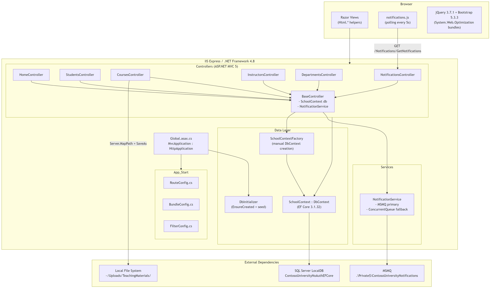
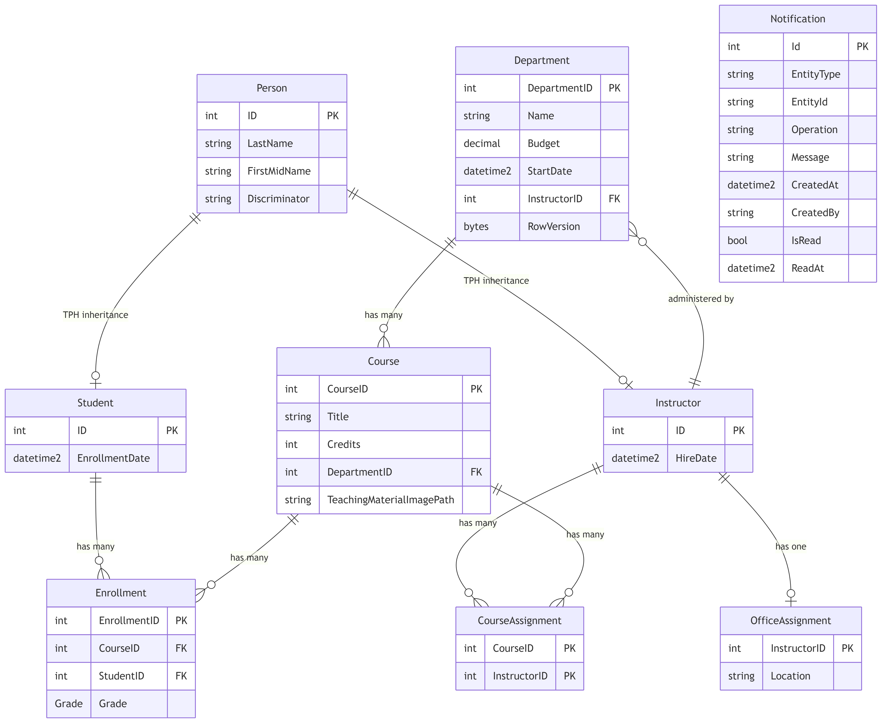

# Contoso University — Migration Inventory

> Findings from codebase analysis of `src/ContosoUniversity/`. This document captures **what exists today** — no migration recommendations.

---

## 1. Technology Stack

| Layer | Technology | Version |
|---|---|---|
| Runtime | .NET Framework | 4.8 |
| Web framework | ASP.NET MVC | 5.2.9 |
| View engine | Razor | 3.2.9 |
| ORM | Entity Framework Core | 3.1.32 |
| Database | SQL Server LocalDB | 2019+ |
| Messaging | MSMQ (System.Messaging) | Windows built-in |
| Hosting | IIS Express | — |
| JS libraries | jQuery 3.7.1, Bootstrap 5.3.3 | via NuGet |
| Serialization | Newtonsoft.Json | 13.0.3 |
| Package format | packages.config | 44 packages |

---

## 2. Architecture Diagram

---

## 3. Data Model (Entity Relationship Diagram)

**Inheritance strategy**: Table-per-Hierarchy (TPH). `Person`, `Student`, and `Instructor` share a single `Person` table with a `Discriminator` column. Configured via Fluent API in `SchoolContext.OnModelCreating()`.

**Concurrency control**: `Department.RowVersion` is a `[Timestamp]` byte array for optimistic concurrency.

**Seed data** (via `DbInitializer.Initialize()`): 8 students, 5 instructors, 4 departments, 7 courses, 3 office assignments, 8 course-instructor assignments, 11 enrollments.

---

## 4. File Inventory

### 4.1 Startup & Configuration

| File | Purpose |
|---|---|
| `Global.asax.cs` | Application entry point; registers areas, filters, routes, bundles; calls `DbInitializer.Initialize()` |
| `Web.config` | Connection string (`(LocalDb)\MSSQLLocalDB`), MSMQ queue path, assembly binding redirects, `httpRuntime` limits (10 MB upload, 3600s timeout) |
| `packages.config` | 44 NuGet package references targeting `net482` |
| `ContosoUniversity.csproj` | .NET Framework 4.8 project file (non-SDK style) |

### 4.2 App_Start (3 files)

| File | Purpose |
|---|---|
| `RouteConfig.cs` | Default `{controller}/{action}/{id}` route |
| `BundleConfig.cs` | jQuery, Bootstrap, Modernizr, validation bundles via `System.Web.Optimization` |
| `FilterConfig.cs` | Global `HandleErrorAttribute` only; authorization commented out |

### 4.3 Controllers (7 files)

| File | Key Dependencies | Functionality |
|---|---|---|
| `BaseController.cs` | `SchoolContextFactory`, `NotificationService` | Abstract base; creates DbContext via factory, instantiates `NotificationService` via `new`, provides `SendEntityNotification()` helper |
| `HomeController.cs` | — | Index, About (enrollment stats via `EnrollmentDateGroup`), Contact, Error |
| `StudentsController.cs` | `PaginatedList<T>` | CRUD + search/sort/pagination (10 per page) |
| `CoursesController.cs` | `HttpPostedFileBase`, `Server.MapPath` | CRUD + image upload (5 MB max, `.jpg/.png/.gif/.bmp`) to `~/Uploads/TeachingMaterials/` |
| `InstructorsController.cs` | `InstructorIndexData` view model | CRUD + hierarchical instructor→courses→enrollments drilldown, course assignment checkboxes |
| `DepartmentsController.cs` | `DbUpdateConcurrencyException` | CRUD with optimistic concurrency conflict handling |
| `NotificationsController.cs` | — | `GetNotifications()` JSON endpoint (drains queue, max 10), `MarkAsRead()` (no-op stub), dashboard view |

### 4.4 Models (9 entity files + 1 enum + view models)

| File | Type | Notes |
|---|---|---|
| `Person.cs` | Abstract base class | `ID`, `LastName`, `FirstMidName`, computed `FullName` |
| `Student.cs` | Extends `Person` | `EnrollmentDate`, `ICollection<Enrollment>` |
| `Instructor.cs` | Extends `Person` | `HireDate`, `ICollection<CourseAssignment>`, `OfficeAssignment` |
| `Course.cs` | Entity | `CourseID` (manual), `Title`, `Credits`, `DepartmentID` FK, `TeachingMaterialImagePath` |
| `Enrollment.cs` | Entity + `Grade` enum | `EnrollmentID`, `CourseID`/`StudentID` FKs, nullable `Grade` (A–F) |
| `Department.cs` | Entity | `Budget` (money), `RowVersion` (timestamp), nullable `InstructorID` FK (administrator) |
| `CourseAssignment.cs` | Join entity | Composite PK (`CourseID`, `InstructorID`) |
| `OfficeAssignment.cs` | Entity | Shared PK/FK (`InstructorID`), 1:1 with Instructor |
| `Notification.cs` | Entity | `EntityType`, `EntityId`, `Operation` (CREATE/UPDATE/DELETE), `Message`, `IsRead` |
| `SchoolViewModels/` | View models | `InstructorIndexData`, `AssignedCourseData`, `EnrollmentDateGroup`, `ErrorViewModel` |

### 4.5 Data Access (3 files)

| File | Purpose |
|---|---|
| `SchoolContext.cs` | DbContext with 9 `DbSet<>` properties; Fluent API: TPH discriminator, composite keys, 1:1 relationships, `datetime2` convention |
| `SchoolContextFactory.cs` | Static factory; reads connection string from `ConfigurationManager`, builds `DbContextOptions`, returns `new SchoolContext(options)` |
| `DbInitializer.cs` | `EnsureCreated()` + seed data; guard: skips if any students exist |

### 4.6 Services (2 files)

| File | Purpose |
|---|---|
| `NotificationService.cs` | Sends/receives `Notification` objects. Primary: MSMQ (`System.Messaging.MessageQueue`). Fallback: static `ConcurrentQueue<string>`. Serialization: `Newtonsoft.Json`. `MarkAsRead()` is a no-op. |
| `LoggingService.cs` | Empty placeholder |

### 4.7 Views

| Folder | Files | Notable Patterns |
|---|---|---|
| `Shared/` | `_Layout.cshtml`, `Error.cshtml` | `@Scripts.Render()`, `@Styles.Render()`, includes `notifications.js` on every page |
| `Students/` | Index, Details, Create, Edit, Delete | `@Html.ActionLink`, `@Html.EditorFor`, `@Html.ValidationMessageFor` throughout |
| `Courses/` | Index, Details, Create, Edit, Delete | `Html.BeginForm` with `enctype="multipart/form-data"` for file upload |
| `Instructors/` | Index, Details, Create, Edit, Delete | Hierarchical master-detail with course checkboxes |
| `Departments/` | Index, Details, Create, Edit, Delete | Hidden `RowVersion` field for concurrency token |
| `Notifications/` | Index | Static info dashboard |
| `Home/` | Index, About, Contact | `About` uses `EnrollmentDateGroup` aggregation |

### 4.8 Client-Side Assets

| File/Folder | Purpose |
|---|---|
| `Scripts/notifications.js` | Polls `GET /Notifications/GetNotifications` every 5s; renders toast notifications top-right; auto-dismiss after 60s; max 5 visible |
| `Content/notifications.css` | Toast styling |
| `Content/site.css` | App-specific styles |
| `Scripts/` | jQuery 3.7.1, Bootstrap 5.3.3 JS, jQuery Validation, Modernizr |
| `Content/` | Bootstrap 5.3.3 CSS |

### 4.9 File Storage

| Path | Purpose |
|---|---|
| `~/Uploads/TeachingMaterials/` | Teaching material images; filename pattern: `course_{CourseID}_{Guid}{ext}` |

---

## 5. External Dependencies

| Dependency | Usage | Protocol/API |
|---|---|---|
| **SQL Server LocalDB** | All entity persistence via EF Core | Connection string in `Web.config`; integrated auth |
| **MSMQ** | Notification queue | `System.Messaging.MessageQueue`; private queue `.\Private$\ContosoUniversityNotifications`; JSON payloads |
| **Local file system** | Teaching material image storage | `Server.MapPath()` + `HttpPostedFileBase.SaveAs()` |

---

## 6. API Surfaces

| Endpoint | Verb | Returns | Used By |
|---|---|---|---|
| `/Notifications/GetNotifications` | GET | `{ success, notifications[], count }` | `notifications.js` polling |
| `/Notifications/MarkAsRead` | POST | `{ success }` | Not actively called (stub) |
| All other routes | GET/POST | Razor HTML views | Standard browser navigation |

---

## 7. Patterns In Use

| Pattern | Where | Details |
|---|---|---|
| MVC | Global | ASP.NET MVC 5 controllers + Razor views |
| TPH inheritance | `Person`/`Student`/`Instructor` | Single `Person` table, `Discriminator` column |
| Base controller | `BaseController.cs` | Shared DbContext + NotificationService; all 6 controllers inherit |
| Factory | `SchoolContextFactory.cs` | Manual `DbContextOptions` construction from `ConfigurationManager` |
| Optimistic concurrency | `Department` | `[Timestamp] RowVersion` checked by EF Core on update |
| Fire-and-forget messaging | Notification system | MSMQ send in controller → poll/drain in JS; failures swallowed |
| Polling | `notifications.js` | 5-second interval `fetch()` to JSON endpoint |
| Pagination | `PaginatedList<T>` | Generic `IQueryable` wrapper; used in `StudentsController` (page size 10) |
| Seed-on-startup | `DbInitializer` | `EnsureCreated()` + conditional seed in `Application_Start()` |

---

## 8. Authentication & Authorization

**None**. `FilterConfig.cs` has a commented-out global `AuthorizeAttribute`. All controllers are publicly accessible. `NotificationService` hardcodes `"System"` as the user identity.

---

## 9. Known Code Smells

| Issue | Location |
|---|---|
| File upload validation logic is duplicated | `CoursesController.cs` — identical blocks in `Create()` and `Edit()` |
| `MarkAsRead()` is a no-op stub | `NotificationService.cs` — method body is empty |
| `LoggingService.cs` is empty | `Services/` — placeholder with no implementation |
| Notifications are destructively dequeued | `NotificationsController.GetNotifications()` — consumed on read, not persisted |
| No DI container | All controllers use `new` for `NotificationService` and `SchoolContextFactory.Create()` |
| `Notification` table defined in DbContext but not used for read/write persistence | `SchoolContext.cs` has `DbSet<Notification>` but service uses MSMQ/in-memory queue only |

---

## 10. Migration Challenge Candidates (Highest Difficulty)

| # | Challenge | Why It's Hard | Affected Files |
|---|---|---|---|
| 1 | **MSMQ → replacement** | `System.Messaging` does not exist in .NET 9. MSMQ is a Windows-only technology with no direct cross-platform equivalent. Requires selecting and integrating a new messaging approach. | `NotificationService.cs`, `Web.config` (queue path) |
| 2 | **Global.asax → Program.cs / Startup** | The entire application bootstrap (`Application_Start`) — route registration, bundle config, filter config, DB seeding — must be restructured into the .NET 9 hosting model (`WebApplicationBuilder` / middleware pipeline). | `Global.asax.cs`, `App_Start/*` (3 files) |
| 3 | **System.Web.Optimization bundles → alternative** | `BundleConfig.cs` uses `ScriptBundle`/`StyleBundle` and views use `@Scripts.Render()` / `@Styles.Render()`. No equivalent in .NET 9; needs a new bundling/minification strategy. | `BundleConfig.cs`, `_Layout.cshtml`, all views using `@Scripts.Render` |
| 4 | **ASP.NET MVC 5 → ASP.NET Core MVC** | Html helpers (`@Html.ActionLink`, `@Html.EditorFor`, `@Html.ValidationMessageFor`, `@Html.BeginForm`) must migrate to Tag Helpers. Controller base classes change from `System.Web.Mvc` to `Microsoft.AspNetCore.Mvc`. | All 7 controllers, all ~30 Razor views |
| 5 | **Non-SDK `.csproj` + `packages.config` → SDK-style** | 44 NuGet packages in `packages.config` with a legacy `.csproj` format. Must convert to SDK-style project with `<PackageReference>` entries, dropping packages that are now built-in. | `ContosoUniversity.csproj`, `packages.config` |
| 6 | **EF Core 3.1 → EF Core 9** | Several breaking changes across 6 major versions (3.1 → 5 → 6 → 7 → 8 → 9). `SchoolContextFactory` with manual `ConfigurationManager` must be replaced by DI-based `DbContext` registration. | `SchoolContext.cs`, `SchoolContextFactory.cs`, `DbInitializer.cs` |
| 7 | **File upload via `Server.MapPath` + `HttpPostedFileBase`** | `Server.MapPath()` and `HttpPostedFileBase` don't exist in .NET 9. File handling must switch to `IFormFile` and `IWebHostEnvironment.WebRootPath`/`ContentRootPath`. | `CoursesController.cs`, `Courses/Create.cshtml`, `Courses/Edit.cshtml` |
| 8 | **`ConfigurationManager` → `IConfiguration`** | Direct `ConfigurationManager.ConnectionStrings` / `ConfigurationManager.AppSettings` calls are scattered. Must migrate to `appsettings.json` + DI-injected `IConfiguration`. | `SchoolContextFactory.cs`, `NotificationService.cs`, `Web.config` |
| 9 | **No dependency injection** | All services are instantiated via `new` in `BaseController`. Must wire up DI container (`IServiceCollection`) and inject `DbContext`, `NotificationService`, etc. | `BaseController.cs`, all 6 derived controllers |
| 10 | **Razor view syntax changes** | `@model` directives, `@section` blocks, and `_ViewImports.cshtml` differ between MVC 5 and ASP.NET Core. Layout references and partial view invocations need updating. | `_Layout.cshtml`, `_ViewStart.cshtml`, all views |
