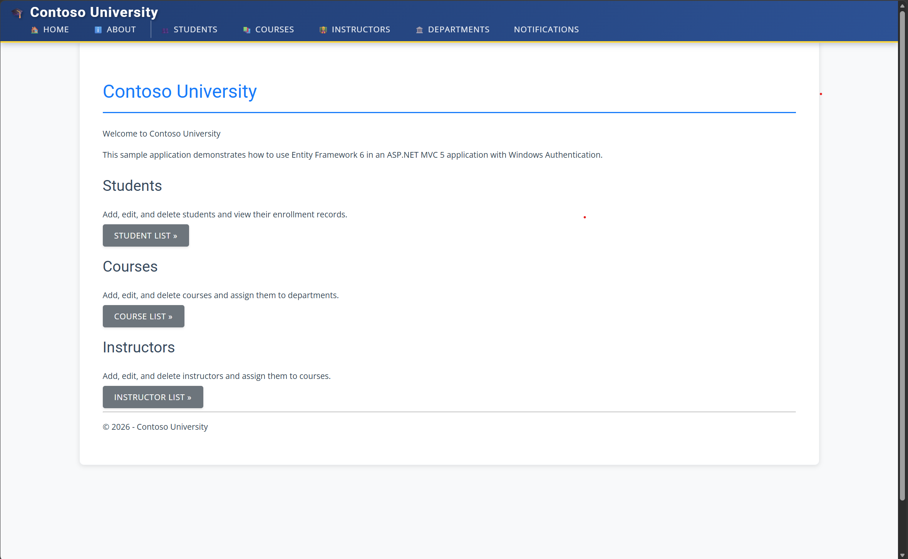
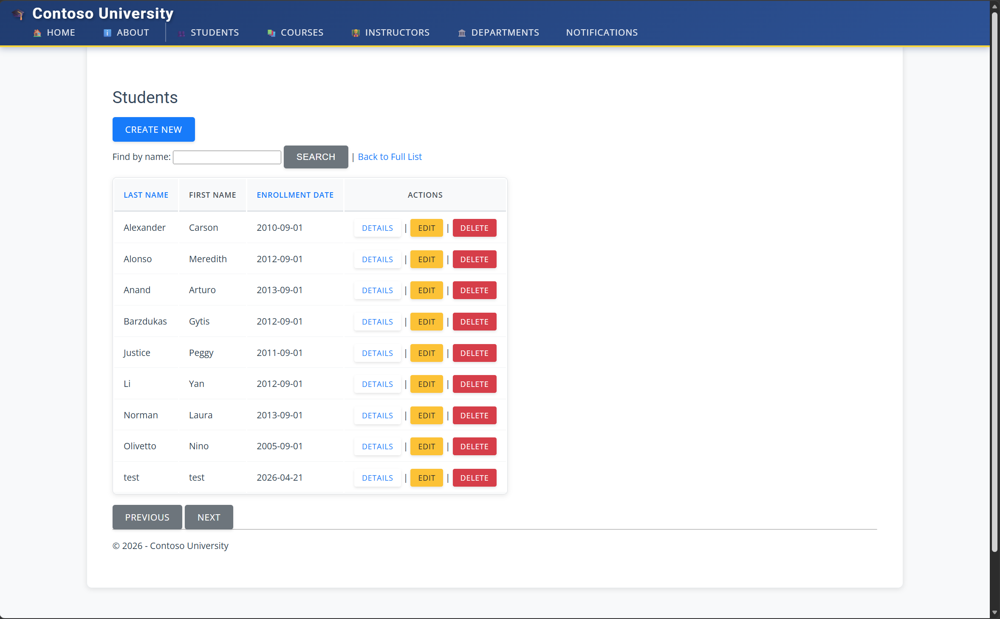
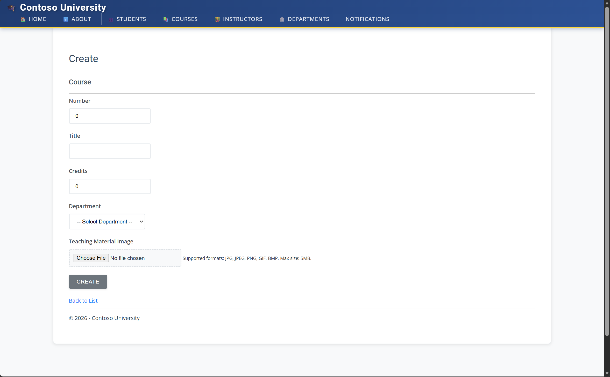
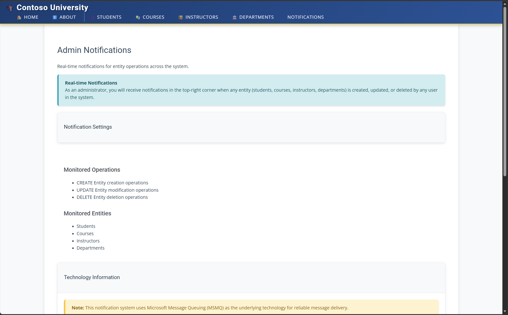

# Lab 2: Understand the Legacy Codebase

**Duration:** 60 minutes  
**Goal:** Run the legacy ContosoUniversity app locally and use GitHub Copilot to build your own understanding of the codebase before migrating it.

---

## Part 1: Run the Legacy App Locally (15 min)

### Prerequisites

Make sure you have the following installed:

- [**Visual Studio 2022**](https://visualstudio.microsoft.com/downloads/) (Community or higher) — or the [**Build Tools for Visual Studio 2022**](https://visualstudio.microsoft.com/downloads/#build-tools-for-visual-studio-2022) with the "ASP.NET and web development" workload
- [**SQL Server LocalDB**](https://learn.microsoft.com/en-us/sql/database-engine/configure-windows/sql-server-express-localdb) (included with Visual Studio)
- **IIS Express** (included with Visual Studio)
- [**.NET Framework 4.8.2 Developer Pack**](https://dotnet.microsoft.com/en-us/download/dotnet-framework/net482)

> **Stuck on prerequisites?** Open Copilot Chat and describe what's not working — it can help you troubleshoot installation issues, find the right download links, or verify your environment.

You can verify your setup by running:

```powershell
# Check Visual Studio is installed
& "${env:ProgramFiles(x86)}\Microsoft Visual Studio\Installer\vswhere.exe" -latest -property installationPath

# Check LocalDB is available
SqlLocalDB.exe info

# Check IIS Express is present
Test-Path "C:\Program Files\IIS Express\iisexpress.exe"
```

### Build and Run

Open a terminal in the root of the workshop repository and run:

```powershell
.\scripts\run-legacy-app.ps1
```

This script restores NuGet packages, builds the solution, and launches IIS Express on **http://localhost:5555**. Your browser should open automatically.

> **First load is slow** — the database gets created and seeded with sample data on the first request (10-15 seconds).

> **Something not working?** Ask Copilot! Paste the error message into Copilot Chat and ask it to help you diagnose the issue. This is a great way to practice using Copilot for troubleshooting.

### Explore the Application

Click through the app and get familiar with what it does:

| Page | What to look for |
|------|-----------------|
| **Students** | List with search, sort, and pagination. Try creating and editing a student. |
| **Courses** | List of courses with department assignments. Note the teaching material image upload feature. |
| **Instructors** | Instructors with office assignments and course assignments (many-to-many). |
| **Departments** | Departments with budget and administrator (instructor) assignment. |
| **About** | Enrollment statistics grouped by date. |







> **Watch the notifications!** After creating, editing, or deleting any entity, look for notification pop-ups in the top-right corner. These are powered by MSMQ (or an in-memory fallback). This is one of the key things we'll be migrating.



When you're done exploring, press `Q` in the terminal running IIS Express to stop the server.

---

## Part 2: Explore the Codebase with Copilot (45 min)

Before migrating any application, you need to inventory and understand the existing codebase. What frameworks and patterns does it use? What are the external dependencies? What will be easy to migrate and what will require significant rework?

In a real migration project, this discovery phase is critical — you can't plan a migration without knowing what you're migrating.

### Your Task

Use GitHub Copilot Chat to build a comprehensive picture of this application. Your goal is to produce a **migration inventory** — a structured overview that covers:

1. **Architecture & frameworks** — What is the tech stack? What patterns does the code follow?
2. **Data model** — What entities exist? How are they related? What database features are used?
3. **External dependencies** — What infrastructure does the app need beyond the code itself (database, messaging, file system, etc.)?
4. **Notification system** — How do notifications flow from a CRUD operation to the browser? This is the most complex subsystem.
5. **File handling** — How are file uploads handled and where are files stored?
6. **Migration risks** — Which APIs, namespaces, and patterns don't exist in .NET 9 / ASP.NET Core? What are the replacements?

### How to Approach This

- Start broad, then drill into specific areas
- Ensure Copilot has the full codebase as context
- Ask follow-up questions when an answer mentions something you want to understand better
- Don't just read the answers — verify them by opening the files Copilot references
- Try to find things Copilot might miss or get wrong

### Deliverable

By the end of this exercise, save your findings as a markdown file — for example `migration-inventory.md` in the repo root. This should be something you could hand to a colleague and say "here's what this app does and what needs to change to move it to .NET 9."

This isn't just a lab exercise — we'll use this inventory as input for creating a formal migration plan with Spec Kit. The better your inventory, the better your plan will be.

---

## Summary

By now you should:

- Have the legacy app building and running locally on IIS Express
- Have explored the application's UI and understood what it does
- Have used Copilot to build your own understanding of the architecture, data model, and dependencies
- Have identified the key migration challenges ahead

**Next up:** [Lab 3 — Plan the Modernization](lab3-plan-modernization.md) where we turn your findings into a formal migration plan with Spec Kit!
